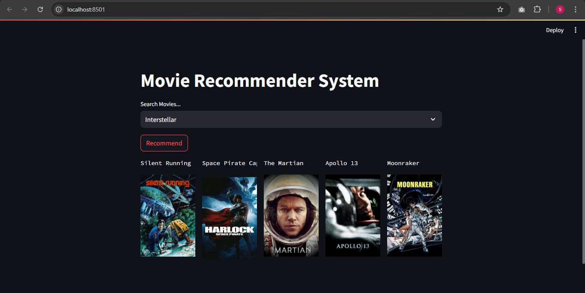

# 🎬 Movie Recommender System  

A **content-based Movie Recommendation System** built using **Python, Streamlit, and NLP techniques**.  
This app suggests movies similar to the one you select, based on features like genres, cast, and descriptions.  

---

## ✨ Features
- 🔍 Search for your favorite movie  
- 🎯 Get **top 5 similar movie recommendations**  
- 🧠 Uses **TF-IDF Vectorization + Cosine Similarity**  
- ⚡ Interactive **Streamlit UI**  
- 📊 Built with **pandas, numpy, scikit-learn**  

---

## 🛠️ Tech Stack
- **Frontend/UI** → Streamlit  
- **Backend/Logic** → Python (pandas, numpy, scikit-learn)  
- **Dataset** → Movies Metadata (Kaggle / TMDB dataset) : https://www.kaggle.com/datasets/tmdb/tmdb-movie-metadata 

---

## 📸 Screenshots

### Recommendation Results  
  

### Recommendation Results  
  

## 🚀 Installation & Setup

1. Clone the repository  
   ```bash
   git clone https://github.com/your-username/Movie-Recommender-System.git
   cd Movie-Recommender-System

2. Create Virtual Environment (recommended)
    ```bash
    # For Windows
    python -m venv .venv
    .venv\Scripts\activate

   # For Mac/Linux
   python -m venv .venv
   source .venv/bin/activate

3. Install Dependencies
   ```bash
   pip install -r requirements.txt

4. Run the Streamlit App
   ```bash
   streamlit run app.py

📂 Project Structure:

```bash
Movie_Recommender_System/
│
├── README.md                      # Project description, usage, setup instructions
├── p1.PNG                         # Screenshot 1
├── p2.PNG                         # Screenshot 2
│
└── movie rs new/                  # Main project folder
    ├── app.py                     # Streamlit/Django/Flask main app file
    ├── movie-recommender-system-new.ipynb   # Jupyter Notebook (exploration, EDA, model building)
    ├── movie_dict.pkl             # Pickle file containing movie dictionary (title, id, etc.)
    ├── movies.pkl                 # Pickle file containing movie feature vectors (for similarity search)
    └── requirements.txt           # Python dependencies


